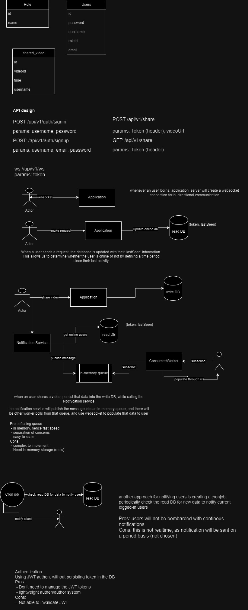

Frontend repo: https://github.com/halo8880/sharevideo-fe  
Backend Tech used: Java, Spring framework, Postgres, redis (as message broker and cache database), JWT authentication, websocket 
Frontend tech: React, Material-UI  

**Spend too much time focusing on design and backend service, the frontend is not as good as I expected.**  

how to run locally using docker:
1. make sure you have docker and docker-compose installed
2. clone the repo
3. cd into docker/deliver: `cd docker/deliver`
4. run `docker-compose up redis postgres -d` and wait for some seconds to make sure those services are up and running
5. run `docker-compose up backend frontend -d` to start the remaining services
6. The frontend app should be running at `http://localhost:3000`
7. The backend app should be running at `http://localhost:8081`

How to use:
After signing in, there will be a button to share Youtube video URLs, the system current support 3 formats:
1. https://www.youtube.com/watch?v=videoId
2. https://youtu.be/videoId
3. https://youtube.com/videoId
